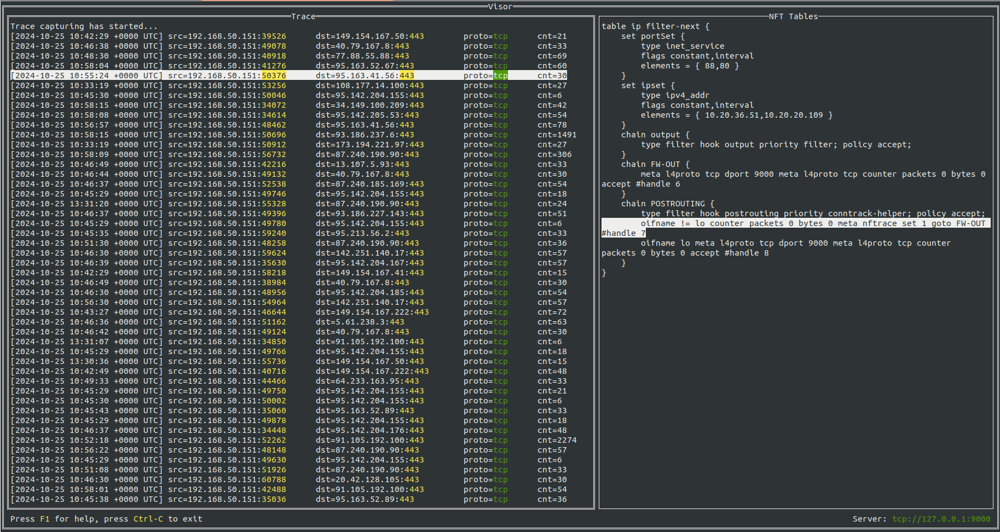

## Visor (a.k.a pkt-tracer)
#### Visor provides a set of utilities for convenient analysis and visualization of network traffic


#### We support:
- Collecting network packets passing through nftables rules marked as 'nftrace set 1'.
- Storing collected traces in the Clickhouse database.
- Providing access to stored traces and flexible analytics.

#### Visor includes following utilities:
- **pkt-tracer** - daemon for collecting network packets that pass through nftables rules marked as 'nftrace set 1', and forward them to a server for storage.
- **trace-hub** - server that implements an API for receiving and storing traces in a database and providing access to them via an API.
- **visor-cli** - command-line network traffic analyzer for fetching and analyzing traces by applied filters.
- **visor-ui** - terminal user interface tier of **visor-cli**.

## Dependencies
Visor depends on [sgroups](https://github.com/wildberries-tech/sgroups) service

## Installation
1) go get github.com/wildberries-tech/pkt-tracer
2) make pkt-tracer && make trace-hub && make visor-cli && make visor-ui
3) executables will be at ./bin/ sub-directory

## Usage
1. Run **trace-hub** server using a configuration file or environment variables

    `trace-hub --config /path/to/config.yml`

    See example of [config.yml](config/trace-hub-config.yaml) file for more details.

    You can also use environment variables instead of configuration file such as:
    - **TH_LOGGER_LEVEL** - log level (*DEBUG* by default)
    - **TH_SERVER_ENDPOINT** - server endpoint address (*tcp://127.0.0.1:9000* by default)
    - **TH_STORAGE_CLICKHOUSE_URL** - URL for connecting to ClickHouse DB (*tcp://localhost:19000/swarm?max_execution_time=60&dial_timeout=10s&client_info_product=trace-hub/0.0.1&compress=lz4&block_buffer_size=10&max_compression_buffer=10240&skip_verify=true* by default)
2. Run **pkt-tracer** daemon using a configuration file or environment variables

    `pkt-tracer --config /path/to/config.yml`

    See example of [config.yml](config/pkt-tracer-config.yml) file for more details.

    You can also use environment variables instead of configuration file such as:
    - **PT_LOGGER_LEVEL** - log level (*DEBUG* by default)
    - **PT_EXTAPI_SVC_TRACEHUB_ADDRESS** - trace-hub server address (*tcp://127.0.0.1:9001* by default)
    - **PT_EXTAPI_SVC_SGROUPS_ADDRESS** - sgroups server address (*tcp://127.0.0.1:9000* by default)
    - **PT_TELEMETRY_USERAGENT** - visor agent id (*tracer0* by default)
3. Run one of **visor-cli** or **visor-ui** utility. For more details please check help for these utilities `visor-ui --help`
4. Make sure you have nftables rules marked as nftrace set 1

```
table ip filter-next {
	chain FW-OUT {
		tcp dport 9000 meta l4proto tcp counter packets 322701 bytes 31879198 accept
	}
	chain POSTROUTING {
		type filter hook postrouting priority 300; policy accept;
		oifname != "lo" counter packets 12092616 bytes 2775470227 meta nftrace set 1 goto FW-OUT
		oifname "lo" tcp dport 9000 meta l4proto tcp counter packets 1087239 bytes 200079882 accept
	}
}
```
